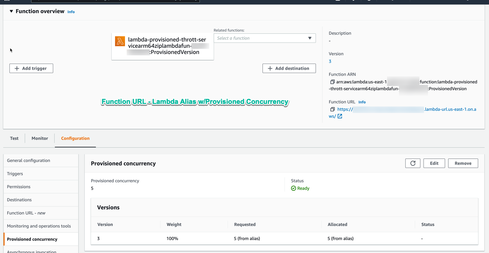
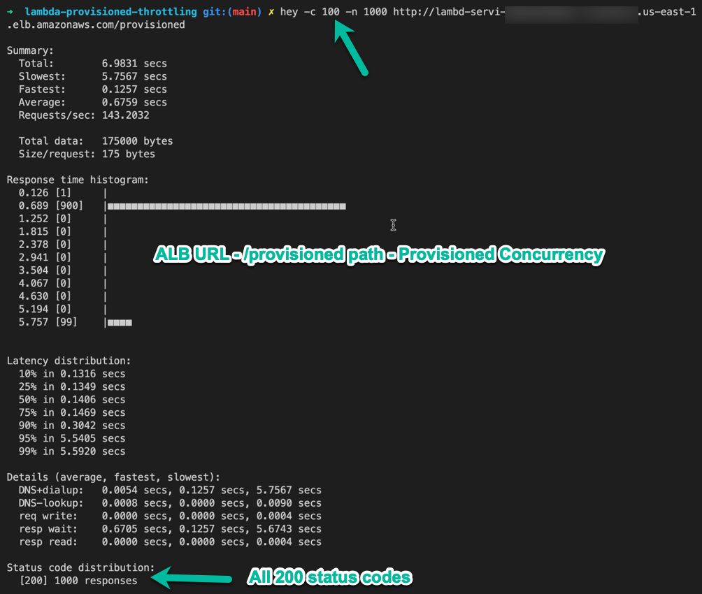
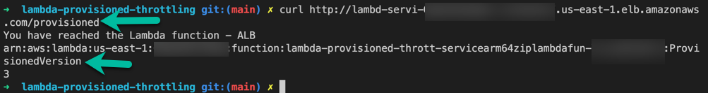
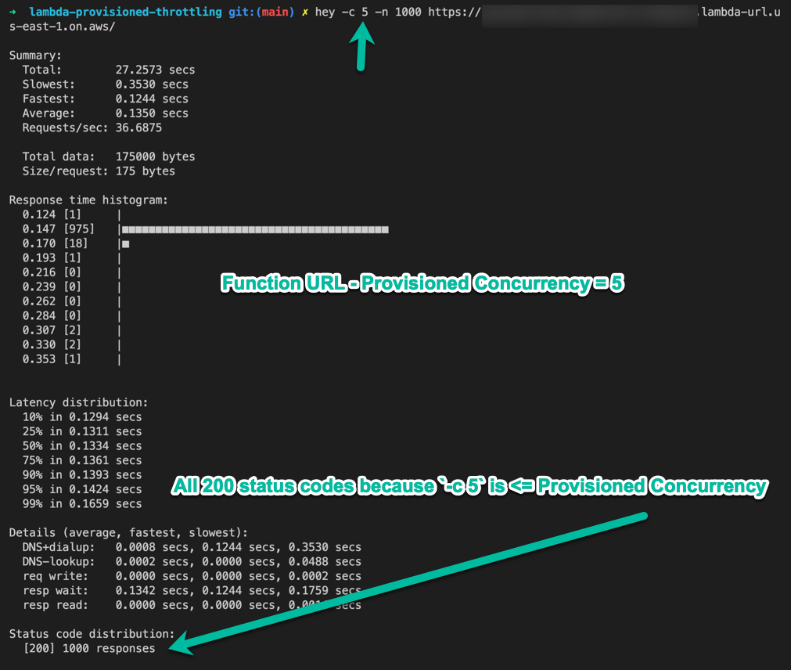
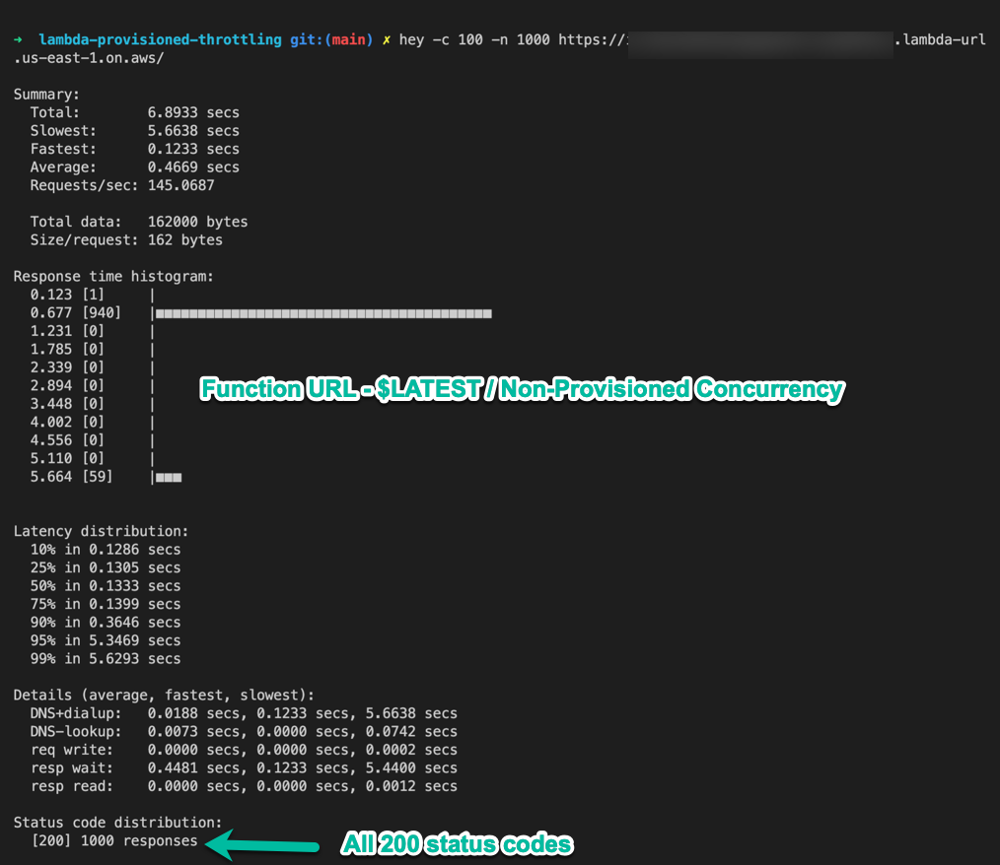
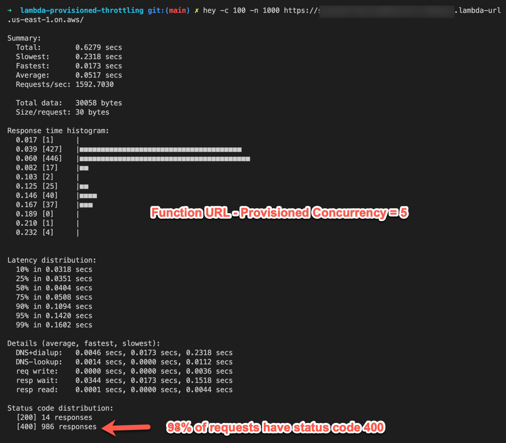
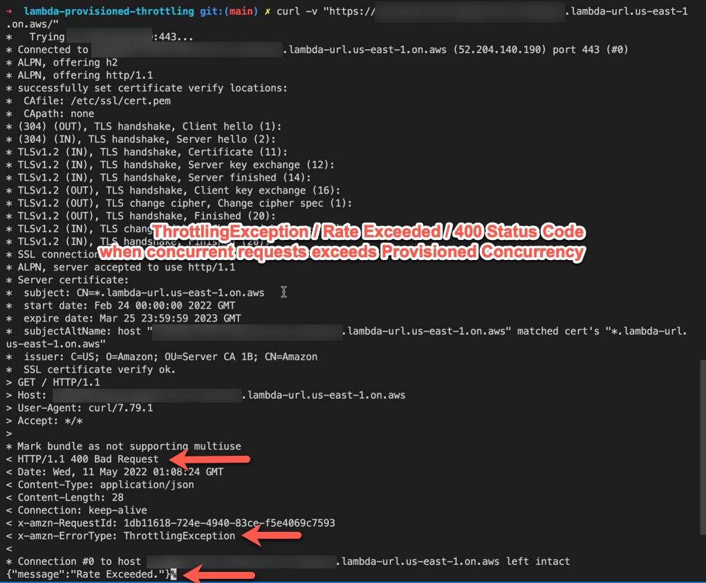
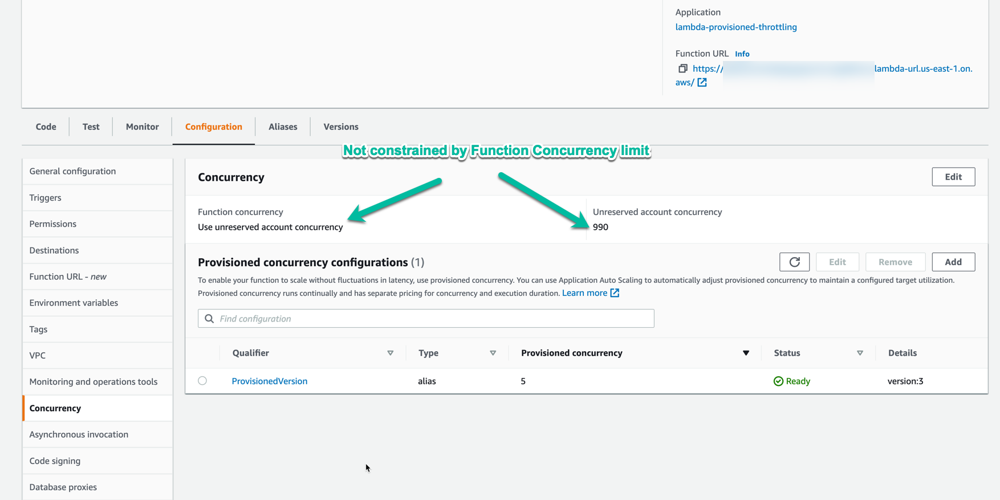

# Overview

This repository contains an example of a possible bug with Lambda Provisioned Concurrency where the function will not scale above the Provisioned Concurrency value, even with Reserved Concurrency set far higher (to account-level unreserved concurrency).

This behavior does not match what is expected and it is demonstrated that an ALB pointing to a Provisioned Concurrency Lambda Alias does not reject requests with a 400 response code beyond the Provisioned Concurrency value.  This seems to confirm that there may be a bug with Function URLs that have Provisioned Concurrency set.

Indications of the error:
- 400 Status Code on response
- `x-amzn-ErrorType: ThrottlingException` header on response
- `{"message":"Rate Exceeded."}` response body

The CDK stack deploys 2 different examples both with an ALB and a Function URL:

- Docker-based Lambda built for ARM64
- Zip-based Lambda built for ARM64

# Security Notice

The AWS Lambda URLs are configured with security set to `lambda.FunctionUrlAuthType.NONE` so they are open to any caller on the Internet. If this violates your security policies, change the type from `lambda.FunctionUrlAuthType.NONE` to `lambda.FunctionUrlAuthType.AWS_IAM`, then use `awscurl` instead of `curl` to test the function invocation.

[auth type config location](packages/cdk/bin/cdk.ts#L12)

# Usage / Deployment

```
nvm use
npm i
npm run build
npm run build:rollup
docker-compose build

docker-compose up
# At this point the service should be up but will not be initialized until first request

# To get a shell, if needed, when `docker-compose up` is running:
docker-compose exec app /bin/sh

# To send a test request to the local instance:
npm run test-local-request

# To deploy to an AWS account
npx cdk deploy

# Invoke the Lambda Function URL
curl -v [paste the URL here]

# Invoke the Lambda ALB URL
curl -v [paste the URL here]
```

## Example Lambda Function Alias with Provisioned Concurrency



# Testing Concurrency Limits

Test concurrency limits using `ab` (apache bench) or `hey` (arguments are the same for both).

[hey](https://github.com/rakyll/hey) - Can be installed as a precompiled binary or via `brew install hey` on Mac.

The default provisioned concurrency of the Lambda Aliases is `5`.

In general, test the following:
- Run with `-c` (concurrent requests) equal to provisioned concurrency
  - In this case there should be no `400` status code responses from any URL
- Run with `-c` much larger than provisioned concurrency (e.g. `-c 100`)
  - In this case the `$LATEST` ALB URL, Provisioned Alias ALB URL, and `$LATEST` Function URL should return no `400` status code responses
  - The Provisioned Alias Function URL will return a large portion of `400` status code responses and will never improve (it's not an issue of needing to start more instances... it simply will not start more instances or send more than `provisioned concurrency` requests to the function)

## Example Command

```
hey -c 100 -n 1000 https://[function-url-id].lambda-url.us-east-1.on.aws/
```

# Results

## ALB URL - Provisioned Concurrency 5 - 100 Concurrent Requests

Result: OK



### Confirmation that `/provisioned` is going to ProvisionedVersion alias



## Function URL - Provisioned Concurrency 5 - 5 Concurrent Requests

Result: OK



## Function URL - Non-Provisioned Concurrency / $LATEST - 100 Concurrent Requests

Result: OK



## Function URL - Provisioned Concurrency 5 - 100 Concurrent Requests

Result: FAILS - 98% of requests return a `400` status code



### Detail of Error

```
curl -v "https://[lambda-provisioned-alias-url].lambda-url.us-east-1.on.aws/"
> GET / HTTP/1.1
> Host: [lambda-provisioned-alias-url].lambda-url.us-east-1.on.aws
> User-Agent: curl/7.79.1
> Accept: */*
> 
* Mark bundle as not supporting multiuse
< HTTP/1.1 400 Bad Request
< Date: Wed, 11 May 2022 01:08:24 GMT
< Content-Type: application/json
< Content-Length: 28
< Connection: keep-alive
< x-amzn-RequestId: 1db11618-724e-4940-83ce-f5e4069c7593
< x-amzn-ErrorType: ThrottlingException
< 
* Connection #0 to host [lambda-provisioned-alias-url].lambda-url.us-east-1.on.aws left intact
{"message":"Rate Exceeded."}
```



### Not Constrained by Function Concurrency / Account Reserved Concurrency

